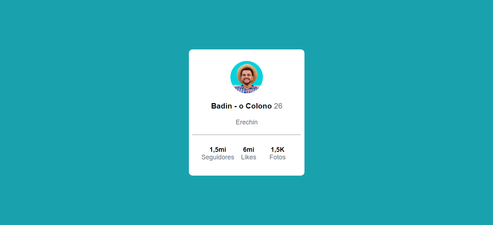

# Curso Dev Quest - Exercício Profile card

Exercício inspirado no desafio [Profile card component challenge on Frontend Mentor](https://www.frontendmentor.io/challenges/profile-card-component-cfArpWshJ). O Exercício serve para botar em prática o que foi ensinado sobre flexbox.

## Tabela de conteúdos

- [Visão Geral](#visão-Geral)
  - [O Desafio](#o-desafio)
  - [Screenshots](#screenshots)
  - [Links](#links)
- [Meu processo](#meu-processo)
  - [Construido com](#construido-com)
  - [O que aprendi](#O-que-aprendi)
  - [Recursos úteis](#Recursos-úteis)
- [Autor](#autor)

## Visão Geral

### O Desafio

- Construir o projeto de acordo com o design fornecido usando HTML e CSS.

### Screenshots

### Links

- Solution URL: [Add solution URL here](https://your-solution-url.com)
- Live Site URL: [Add live site URL here](https://your-live-site-url.com)

## Meu processo

### Construido com

- HTML5
- CSS
- Flexbox

### O que aprendi

Usei o projeto para treinar o que foi ensinado nas aulas de flexbox do curso. Como as propriedades justify-content, align-items, flex, etc.

### Recursos úteis

- [Develiper Mozilla](https://developer.mozilla.org/pt-BR/docs/Web/CSS/CSS_Flexible_Box_Layout/Basic_Concepts_of_Flexbox) - Os artigos sobre flexbox foram úteis para ajudar a compreender os atributos de posicionamento.

## Autor

- Facebook - [Evandro Passaia](https://www.facebook.com/evandro.passaiaze)
- Frontend Mentor - [@EvandroBaraka](https://www.frontendmentor.io/profile/EvandroBaraka)
- Github - [@EvandroBaraka](https://github.com/EvandroBaraka)